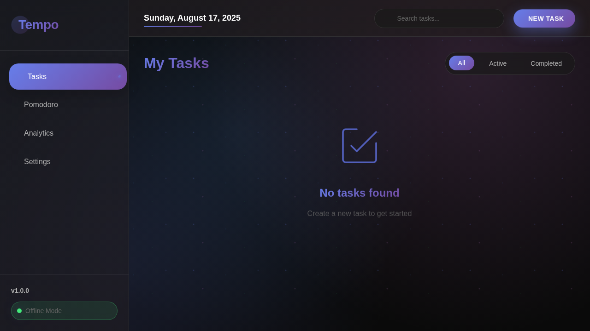
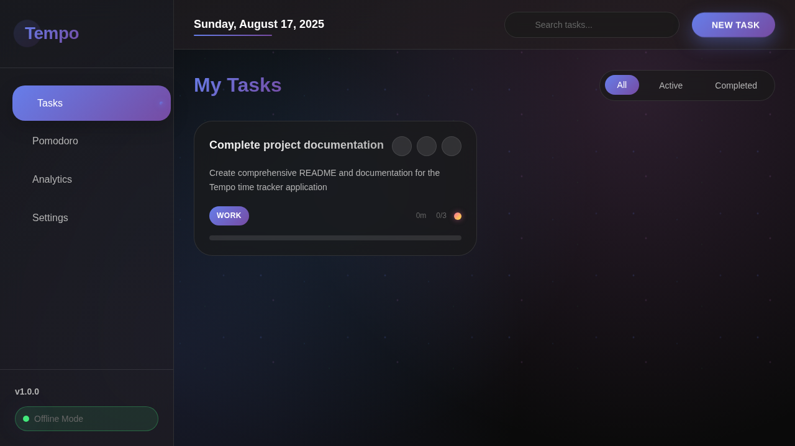
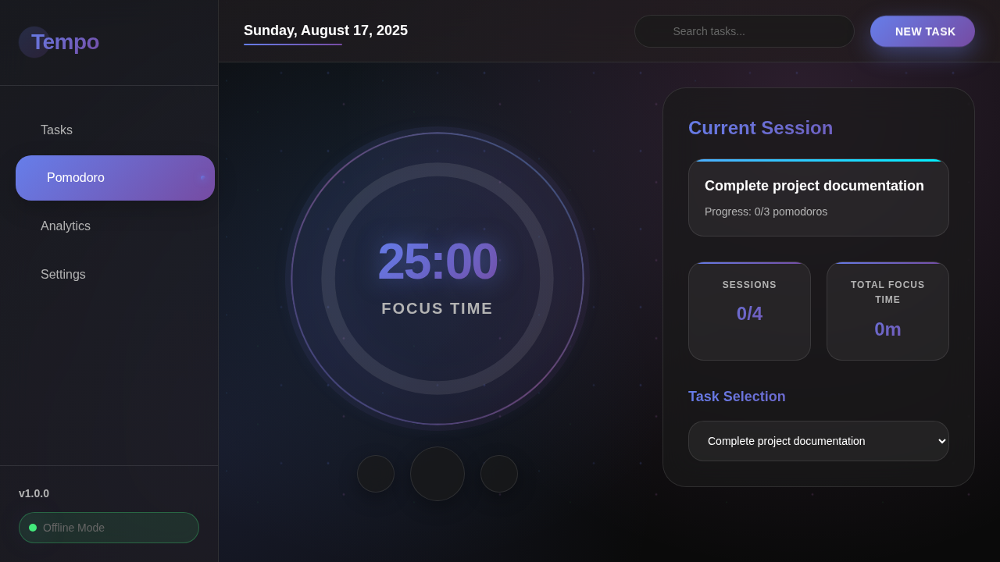

# ⏰ Tempo - Offline Time Tracker

[](https://github.com/abhinavramanan/temp)
[](LICENSE)
[](#features)

A beautiful, feature-rich **offline time tracker** and productivity application with integrated Pomodoro timer, task management, and analytics. Built with pure HTML, CSS, and JavaScript for maximum compatibility and zero dependencies.



## 📸 Screenshots

### Task Management

*Create and manage tasks with detailed information, categories, priorities, and progress tracking*

### Pomodoro Timer

*Focus sessions with visual timer, task integration, and session tracking*

## ✨ Features

### 📋 **Task Management**
- Create, edit, and delete tasks with rich metadata
- Categorize tasks (Work, Personal, Study, etc.)
- Set priority levels (Low, Medium, High, Critical)
- Add deadlines and estimated Pomodoro sessions
- Filter tasks by status (All, Active, Completed)
- Search functionality for quick task discovery

### 🍅 **Pomodoro Timer**
- Fully customizable Pomodoro technique implementation
- Visual circular timer with smooth animations
- Configurable focus duration (default: 25 minutes)
- Short breaks (default: 5 minutes) and long breaks (default: 15 minutes)
- Automatic session tracking (4 sessions before long break)
- Task-specific time tracking
- Audio and desktop notifications

### 📊 **Analytics & Insights**
- Comprehensive productivity analytics
- Total time tracked across all tasks
- Task completion rates and statistics
- Pomodoro session history
- Productivity score calculation
- Time distribution by category
- Daily, weekly, monthly, and yearly views
- Exportable data tables

### ⚙️ **Customization & Settings**
- **Timer Settings**: Adjust focus and break durations
- **Notifications**: Toggle sound and desktop notifications
- **Themes**: Light and dark mode support
- **Accent Colors**: Multiple color schemes
- **Data Management**: Export/import functionality
- **Offline Mode**: Complete offline functionality

### 💾 **Data Persistence**
- Local storage for all data persistence
- No server required - fully offline
- Export/import data in JSON format
- Backup and restore capabilities
- Clear data option for fresh starts

## 🚀 Quick Start

### Prerequisites
- Modern web browser (Chrome 70+, Firefox 65+, Safari 12+, Edge 79+)
- No additional software or dependencies required

### Installation

1. **Clone the repository:**
   ```bash
   git clone https://github.com/abhinavramanan/temp.git
   cd temp
   ```

2. **Open in browser:**
   - Double-click `index.html`, or
   - Use a local server (recommended):
     ```bash
     # Using Python
     python -m http.server 8000
     
     # Using Node.js
     npx serve .
     
     # Using PHP
     php -S localhost:8000
     ```

3. **Access the application:**
   - Direct file: `file:///path/to/tempo/index.html`
   - Local server: `http://localhost:8000`

### First Time Setup

1. **Create your first task:**
   - Click "New Task" button
   - Fill in task details (name, category, priority, etc.)
   - Set estimated Pomodoro sessions
   - Save the task

2. **Start a Pomodoro session:**
   - Navigate to the Pomodoro tab
   - Select a task from the dropdown
   - Click the play button to start your focus session

3. **Customize settings:**
   - Go to Settings tab
   - Adjust timer durations to your preference
   - Enable/disable notifications
   - Choose your preferred theme and accent color

## 📱 Usage Guide

### Task Management Workflow

1. **Creating Tasks:**
   ```
   New Task → Fill Details → Set Category/Priority → Add Deadline → Save
   ```

2. **Working with Tasks:**
   - ✅ Mark complete by clicking the checkbox
   - ✏️ Edit task details using the edit button
   - 🗑️ Delete tasks with confirmation dialog
   - 🔍 Use search to quickly find specific tasks

### Pomodoro Workflow

1. **Standard Pomodoro Cycle:**
   ```
   25min Focus → 5min Break → 25min Focus → 5min Break → 
   25min Focus → 5min Break → 25min Focus → 15min Long Break
   ```

2. **Timer Controls:**
   - ▶️ **Start/Pause**: Begin or pause the current session
   - ⏭️ **Next**: Skip to next phase (focus → break → focus)
   - ⏮️ **Previous**: Go back to previous phase
   - 🔄 **Reset**: Reset current timer to beginning

### Analytics Dashboard

- **Summary Cards**: Quick overview of productivity metrics
- **Time Tracking**: Detailed breakdown of time spent per task
- **Completion Rates**: Visual representation of task completion
- **Export Data**: Download detailed reports in JSON format

## 🛠️ Technical Details

### Architecture
- **Frontend**: Pure HTML5, CSS3, JavaScript (ES6+)
- **Storage**: Browser localStorage API
- **Design**: CSS Grid, Flexbox, Glass morphism effects
- **Icons**: Font Awesome 6.0
- **Fonts**: Google Fonts (Poppins)

### Browser Compatibility
| Browser | Minimum Version |
|---------|----------------|
| Chrome  | 70+ |
| Firefox | 65+ |
| Safari  | 12+ |
| Edge    | 79+ |

### File Structure
```
tempo/
├── index.html          # Main application file
├── styles.css          # Complete styling and themes
├── script.js           # Application logic and functionality
├── README.md           # This documentation
└── docs/
    └── screenshots/    # Application screenshots
```

### Key Technologies Used
- **CSS Custom Properties**: For dynamic theming
- **localStorage API**: For data persistence
- **Notification API**: For desktop notifications
- **CSS Animations**: For smooth UI transitions
- **Responsive Design**: Mobile-first approach

## 🎨 Customization

### Themes
Tempo supports multiple themes that can be switched in Settings:
- **Light Theme**: Clean, minimal light interface
- **Dark Theme**: Modern dark mode with blue accents
- **System Default**: Follows system preference

### Accent Colors
Choose from multiple accent color options:
- Blue (#6A7EFC) - Default
- Purple (#8B5CF6)
- Pink (#EC4899)
- Green (#10B981)
- Orange (#F59E0B)

### Timer Customization
All timer durations are fully customizable:
- Focus sessions: 15-60 minutes
- Short breaks: 5-20 minutes
- Long breaks: 10-30 minutes
- Sessions before long break: 2-8 sessions

## 📊 Data Export/Import

### Export Data
1. Go to Settings → Data Management
2. Click "Export Data"
3. Save the JSON file to your computer

### Import Data
1. Go to Settings → Data Management
2. Click "Import Data"
3. Select your previously exported JSON file

### Data Format
```json
{
  "tasks": [...],
  "settings": {...},
  "exportDate": "2024-01-01T00:00:00.000Z"
}
```

## 🔒 Privacy & Security

- **100% Offline**: No data sent to external servers
- **Local Storage**: All data stored in your browser only
- **No Tracking**: No analytics or tracking scripts
- **No Accounts**: No sign-up or login required

## 🤝 Contributing

We welcome contributions! Here's how you can help:

1. **Fork the repository**
2. **Create a feature branch**: `git checkout -b feature/amazing-feature`
3. **Commit your changes**: `git commit -m 'Add amazing feature'`
4. **Push to the branch**: `git push origin feature/amazing-feature`
5. **Open a Pull Request**

### Development Guidelines
- Follow existing code style and conventions
- Test changes across different browsers
- Update documentation for new features
- Keep commits focused and descriptive

### Reporting Issues
- Use the GitHub Issues tab
- Provide detailed reproduction steps
- Include browser and OS information
- Screenshots help for UI issues

## 📄 License

This project is licensed under the MIT License - see the [LICENSE](LICENSE) file for details.

## 🙏 Acknowledgments

- **Pomodoro Technique**: Developed by Francesco Cirillo
- **Font Awesome**: For beautiful icons
- **Google Fonts**: For Poppins typography
- **Glass Morphism**: For modern UI design inspiration

## 📞 Support

If you encounter any issues or have questions:

1. Check the [Issues](https://github.com/abhinavramanan/temp/issues) page
2. Create a new issue with detailed information
3. For general questions, use the Discussions tab

---

**Built with ❤️ for productivity enthusiasts**

*Tempo helps you focus on what matters most while keeping track of your progress along the way.*